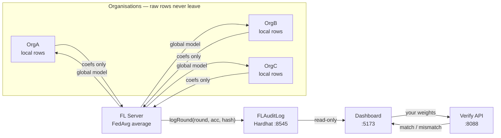

# FedLedger

**Federated Learning with Blockchain Audit Trail**

Three organisations train a shared ML model using Federated Learning without sharing raw data. After every training round, a permanent Ethereum transaction records the round number, accuracy, participants, and a SHA-256 hash of the aggregated model weights — a tamper-proof, independently verifiable audit trail of the whole training process.

**Stack:** Python · Flower (flwr) · scikit-learn · Hardhat · Solidity · web3.py · React (Vite) dashboard

---

## How it works — one round



1. Each organisation trains on its own rows and sends **only the updated coefficients** — no records cross a link.
2. The server averages the three updates (FedAvg) and sends the **global model back to all three**.
3. The round number, accuracy, and weight hash are sealed into **FLAuditLog**, which has no edit or delete function.
4. The **dashboard** displays it all; the **Verify tab** lets anyone recompute the average and check its fingerprint against the chain.

---

## Quickstart

```
python run_fedledger.py
```

That single command starts everything in order — dashboard build, Hardhat node, contract deployment, dashboard server, FL server, all three nodes, verify server — and opens the dashboard in your browser automatically.

To stop: `Ctrl+C`

---

## Manual startup (if you want control over each process)

```
# Terminal 1 — local Ethereum chain
cd blockchain && npx hardhat node

# Terminal 2 — deploy contract (run once per session)
cd blockchain && npx hardhat run scripts/deploy.js --network localhost

# Terminal 3 — dashboard build (first run, and after UI changes)
cd app/web && npm install && npm run build

# Terminal 4 — dashboard HTTP server (port 5173)
python app/dashboard_server.py

# Terminal 5 — FL server (must run from the repo root, not fl_server/)
python -m fl_server.server

# Terminals 6, 7, 8 — one per node
python fl_nodes/node.py --node 1
python fl_nodes/node.py --node 2
python fl_nodes/node.py --node 3

# Terminal 9 — verify API (for dashboard hash verification)
python app/verify_server.py

# Open in browser
http://127.0.0.1:5173
```

---

## Modules

| Module | File | Responsibility |
|---|---|---|
| Launcher | `run_fedledger.py` | One-command startup — builds the dashboard and starts all 7 services in order |
| FL Nodes | `fl_nodes/node.py` | Flower client. Trains locally, sends only weights. One script serves all nodes via `--node 1/2/3`. |
| FL Server | `fl_server/server.py` | Orchestrates rounds, writes `app/round_results.json` after each round |
| FedAvg | `fl_server/fedavg.py` | Weighted aggregation of local weights + SHA-256 weight hashing |
| Audit Bridge | `fl_server/blockchain_logger.py` | Connects Python to the smart contract via web3.py |
| Contract | `blockchain/contracts/FLAuditLog.sol` | Append-only audit log on-chain — no delete or edit functions |
| Deploy Script | `blockchain/scripts/deploy.js` | Deploys the contract, writes address to `contract_config.json` |
| Dashboard | `app/web/` | Vite + React app — live FL diagram, accuracy chart, blockchain feed, hash verification (built to `app/web/dist`) |
| Dashboard Server | `app/dashboard_server.py` | Serves the built dashboard on port 5173 + read-only chain RPC proxy |
| Verify Server | `app/verify_server.py` | Tiny HTTP server (port 8088) the dashboard calls for hash verification |
| Dataset | `data/generate_partitions.py` | Splits Iris into 3 private node partitions |
| Tests | `tests/` | Unit tests for FedAvg, blockchain logging, hash verification |

---

## Structure

```
FedLedger/
├── run_fedledger.py               # One-command launcher
├── fl_nodes/
│   └── node.py                    # Flower client (any node via --node)
├── fl_server/
│   ├── server.py                  # Flower server + FedAvg orchestration
│   ├── fedavg.py                  # FedAvg aggregation + weight hashing
│   └── blockchain_logger.py       # Ethereum audit-trail bridge (web3.py)
├── blockchain/
│   ├── contracts/FLAuditLog.sol   # Append-only audit smart contract
│   ├── scripts/deploy.js          # Hardhat deployment script
│   ├── hardhat.config.js          # Hardhat config (Ethers v6)
│   └── contract_config.json       # Contract address + ABI path (auto-written)
├── app/
│   ├── web/                       # Vite + React dashboard (src/, builds to dist/)
│   ├── dashboard_server.py        # Serves the built dashboard on port 5173
│   ├── verify_server.py           # Hash verify API on port 8088
│   └── round_results.json         # Written by server.py after each round
├── data/
│   ├── generate_partitions.py     # Split dataset into 3 private partitions
│   └── node1/ node2/ node3/       # Private node partitions (.npy files)
├── tests/
│   ├── test_fedavg.py
│   ├── test_blockchain.py
│   └── test_verify.py
├── docs/
│   └── FedLedger_Reference.md     # Function-by-function implementation guide
├── blockchain/package.json        # Hardhat Node.js dependencies
├── requirements.txt               # Python dependencies
└── README.md
```

---

## How the dashboard works

`server.py` writes `app/round_results.json` after every training round. `app/dashboard_server.py` serves the built dashboard from `app/web/dist` on http://127.0.0.1:5173, which polls that file every 2 seconds and:

- **Overview** — what the run demonstrates, dataset stats, and save/load snapshots of the round feed. A loaded snapshot freezes every tab on that data, survives a reload, and a resume-live pill returns to the feed
- **Federation** — an interactive replay of one round: train → send → aggregate → seal → distribute, with every edge labelled by what actually crosses it. Uploads travel one organisation at a time and land as chips in the server's inbox; the global model returns to all three at once. A speed slider rescales dots and phases together, and Auto / Full / Still controls motion (the OS reduced-motion setting is respected)
- **Ledger** — every round with its on-chain receipt, plus the accuracy curve
- **Verify** — paste or drop your locally recomputed FedAvg weights and compare their hash against the one stored on-chain. The comparison always runs against the real chain, and when the feed is mock data or a frozen snapshot the tab says so — that result is not evidence about the run on screen. For the viva path, load the run's own saved weights for the selected round: that comparison must report a match

The dashboard reads the chain through a read-only RPC proxy (`POST /chain/rpc`), so no write method ever reaches the browser.

---

## How hash verification works

Each round, `fedavg.py` hashes the aggregated model weights with SHA-256 and the audit bridge stores `keccak256(sha256_hash)` on-chain. On the Verify tab you can paste or drop your own recomputed weights — the dashboard sends them to the verify server (port 8088), which recomputes the same SHA-256, applies keccak256, and compares the result to the on-chain bytes32. A match proves the server ran FedAvg honestly without revealing the raw weights.

---

## First run

```bash
# 1. Install Python dependencies
pip install -r requirements.txt

# 2. Install Hardhat (inside blockchain/)
cd blockchain && npm install && cd ..

# 3. Generate data partitions (once)
python data/generate_partitions.py

# 4. Run everything (the launcher also installs/app-builds on first run)
python run_fedledger.py
```

---

*B.E. CS (AI & ML) · Bharat College of Engineering, Badlapur · Mumbai University · Blockchain Technology Mini-Project*
